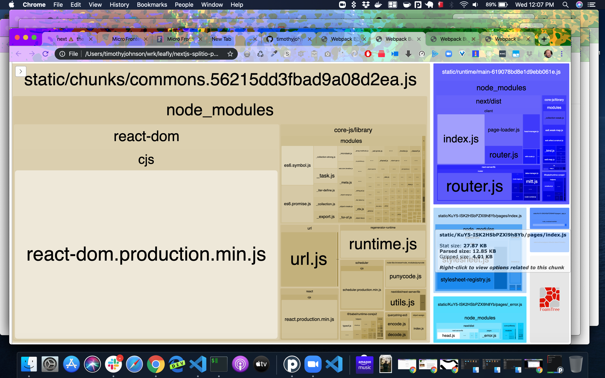
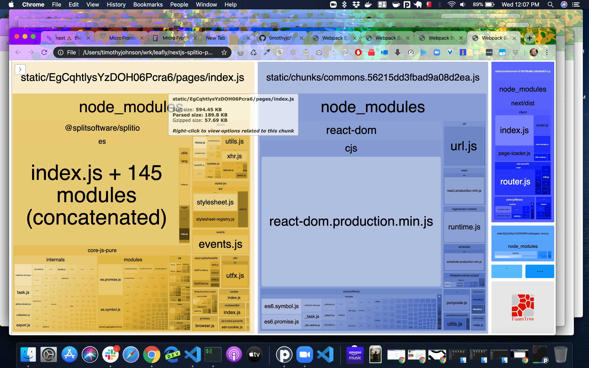

# nextjs-splitio-performance

This is a performance profile of using Split.io's react library with Next.js

`react-splitio` is a 3rd party library that has a dependancy on Split.io's JS SDK. Most of the weight comes from the SDK, not the React library.

## `master` branch

In the bottom right, the Stat size of index.js is 27.87 KB

Gzipped it is 4.01 KB

## `wif-split` branch

In the top left, the Stat size of index.js is 594.45 KB

Gzipped it is 57 KB

Gzipped size is about equal to all of React gzipped, but the stat size is MUCH higher.

## Analysis

All the `.next` production build files are included here in the repo, so you can see these generated analysis HTML files and look through the builds yourself.

You can look here to see the branch comparison, but scroll down past all the `.next` build files and just look at the last 2 files for the difference.

https://github.com/timothyjoh/nextjs-splitio-performance/compare/wif-split
